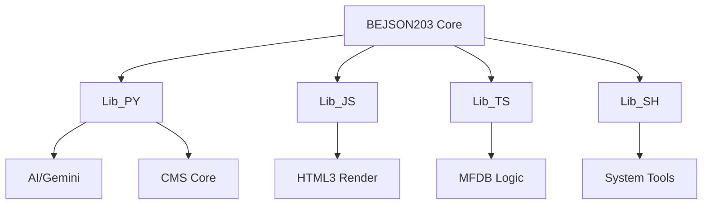

# BEJSON Master Libraries (BEJSON203)
> Authoritative Cross-Runtime Library Suite for the BEJSON Ecosystem.

  

## Vision
BEJSON203 is the foundational engine of the Elton Boehnen ecosystem, providing strict, positional integrity data structures across Python, JavaScript, TypeScript, and Shell. It ensures a single source of truth for agentic data processing and cross-platform application state.

## 2026 Visual Architecture


## Quick Start
```bash
# Verify library integrity
python3 reports/analysis_report_libraries_2026_06_02.md
```

## Implementation Stack
- **Languages**: Python 3.13+, TypeScript 5.4+, JavaScript (ES6+), Bash 5.0+
- **Formats**: BEJSON 104, 104a, 104db
- **Architecture**: Positional Integrity Tables (O(1) Access)

## Documentation Hierarchy
- [llms.txt](./llms.txt) — RAG-optimized index.
- [AGENTS.md](./AGENTS.md) — Strict rules for agentic modification.
- [CHANGE_REPORT.md](./CHANGE_REPORT.md) — Version tracking and delta logs.

---
**Elton Boehnen** · eltonboehnen@gmail.com · [github.com/boehnenelton](https://github.com/boehnenelton)
