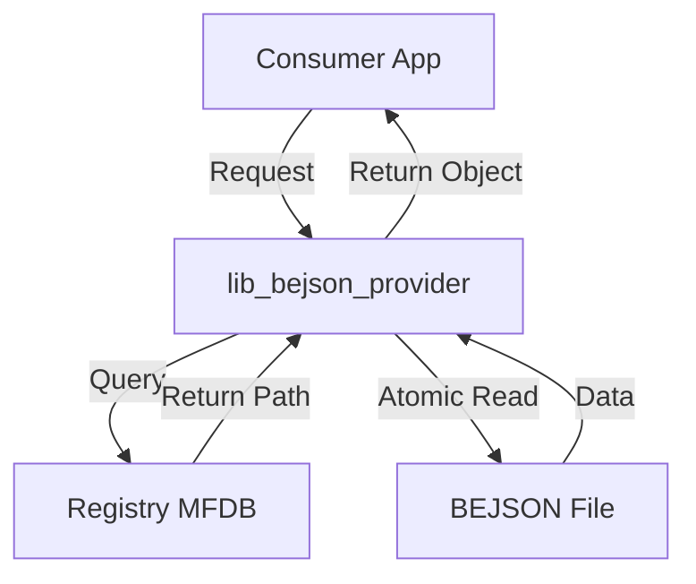

# Research Report: Documentation Ecosystem 2026 & BEJSON Library Documentation Guide
**Date:** 2026-06-05
**Relational ID:** gcli-docs-research-20260605
**Author:** Gemini CLI Agentic Research Unit

---

## 1. Executive Overview
> The 2026 documentation landscape has shifted from "passive text storage" to "active agent-ingestible intelligence." This report outlines the strategy for migrating the BEJSON ecosystem toward a modern, high-density documentation stack hosted on GitHub Pages. The core hypothesis is that documentation must be bifunctional: optimized for human scannability through Bento UI patterns and optimized for machine reasoning (AX - Agent Experience) through structured semantic markers.

- **Dominant Structural Characteristics:** Modular Card-based Layouts, Semantic LLM Indexes, and Automated CI/CD Pipelines.
- **Probable Intent:** Centralize library knowledge, reduce developer onboarding time, and enable CLI agents to autonomously navigate and repair the codebase.
- **Primary Conclusions:** MkDocs with the Material theme is the authoritative choice for the BEJSON ecosystem. All documentation must be "Agent-Ready" by default, utilizing `llms.txt` and `AGENTS.md` protocols.

---

## 2. Part I: GitHub Pages & Static Site Generators (SSGs)
GitHub Pages remains the primary hosting platform for open-source and internal project documentation. In 2026, the choice of generator is no longer about "making a site" but "building a knowledge graph."

### 2.1. The SSG Selection Matrix
The following table ranks generators by their suitability for technical library documentation.

| Tool | Recommended Use | 2026 AX Score | Build Speed |
| :--- | :--- | :--- | :--- |
| **MkDocs** | Technical Documentation (The Standard) | 9.5/10 | Fast (Python) |
| **Jekyll** | Blogs & Simple Sites | 6.0/10 | Slow (Ruby) |
| **Hugo** | Large-scale Portals / Hubs | 8.5/10 | Blazing Fast (Go) |
| **Starlight** | Documentation Sites (Astro) | 9.0/10 | Fast (JS/TS) |

### 2.2. MkDocs: The Authoritative Standard
MkDocs, specifically combined with the **Material for MkDocs** theme, provides the highest density of out-of-the-box features required for the BEJSON project.

- **Material Theme:** Provides a modern, responsive Bento-adjacent interface.
- **Search:** Instant, client-side search indexing.
- **Plugins:** Support for `mkdocstrings` (automated API docs), `mermaid2` (diagrams), and `mike` (versioning).

### 2.3. Automated CI/CD (GitHub Actions)
Documentation must never be manually deployed. The following GitHub Action configuration represents the 2026 industry standard for automated MkDocs deployment.

```yaml
# .github/workflows/docs.yml
name: Deploy Documentation
on:
  push:
    branches: [main]
    paths:
      - 'docs/**'
      - 'mkdocs.yml'
      - 'libraries/**'

jobs:
  deploy:
    runs-on: ubuntu-latest
    steps:
      - uses: actions/checkout@v4
        with:
          fetch-depth: 0

      - name: Set up Python
        uses: actions/setup-python@v5
        with:
          python-version: '3.11'

      - name: Install dependencies
        run: |
          pip install mkdocs-material mkdocstrings[python] mkdocs-mermaid2-plugin

      - name: Build and Deploy
        run: |
          # Use mike for versioned documentation if needed
          mkdocs gh-deploy --force --clean --verbose
```

---

## 3. Part II: Agent-Ready Documentation (AX - Agent Experience)
Documentation is the "long-term memory" of an AI agent. In 2026, we optimize for "Agent Experience" (AX) alongside "User Experience" (UX).

### 3.1. The `llms.txt` Standard
A `llms.txt` file must be placed in the project root. This is a plain-text, high-density summary designed for LLMs to ingest during a session setup.

- **Structure:**
    - Project Overview.
    - Core Architecture (Bullet points).
    - Primary API Endpoints.
    - Critical Constraints (e.g., "Always use atomic writes").
    - Dependency Graph.

### 3.2. `AGENTS.md`: The Agentic Workflow Guide
While `README.md` is for humans, `AGENTS.md` is the "Standard Operating Procedure" for AI assistants. It defines:
- **Cognitive Boundaries:** What the agent should and should not touch.
- **Coding Mandates:** Specific patterns (e.g., "Use snake_case for fields").
- **Verification Protocols:** How to validate changes (e.g., "Run `test_all.py` before committing").

### 3.3. Mermaid.js Diagramming
Agents cannot "see" PNG screenshots effectively. We mandate text-based diagrams using Mermaid.js.



---

## 4. Part III: Bento UI for Documentation
Bento UI (modular grid-based layout) is the 2026 standard for high-scannability landing pages. It allows a developer to "perceive" the entire library's surface area in a single glance.

### 4.1. The Bento Landing Page Pattern
The documentation homepage should be divided into functional "Cards":

1.  **The Hero Card:** `pip install bejson-libraries` + Version Badge.
2.  **The Architecture Card:** High-level system diagram.
3.  **The Getting Started Card:** 5-line quick start example.
4.  **The Core APIs Card:** Grid of links to Lib_PY, Lib_SH, Lib_JS.
5.  **The Schema Registry Card:** Direct link to 104/104a/104db specs.

### 4.2. Implementation via CSS Grid
```css
/* Bento Grid Layout */
.c-bento-grid {
    display: grid;
    grid-template-columns: repeat(4, 1fr);
    grid-auto-rows: minmax(150px, auto);
    gap: 20px;
}

.c-card--hero { grid-column: span 3; grid-row: span 2; }
.c-card--quick { grid-column: span 1; grid-row: span 1; }
.c-card--api { grid-column: span 2; grid-row: span 1; }
```

---

## 5. Part IV: The BEJSON Library Documentation Guide
This section defines the **Authoritative Standard** for documenting all libraries within the BEJSON ecosystem.

### 5.1. File Header Mandate
Every source file MUST contain a standardized Docstring header. This is critical for automated parsing and Agent awareness.

```python
"""
Library:      [Name].py
Family:       [AI | Core | HTML | Utility | System]
Jurisdiction: ["BEJSON_LIBRARIES", "PY"]
Relational ID: [GUID]
Version:      [X.Y.Z] OFFICIAL
Date:         [YYYY-MM-DD]
Description:  [One-sentence summary].

REMEDIATED:   [List of major fixes or migrations].
"""
```

### 5.2. Documenting Schemas
BEJSON schemas are self-describing, but the documentation site must provide a "Human-Readable Manifest."

- **Schema Metadata:** `Format`, `Format_Version`, `Records_Type`.
- **Field Definition Table:** Name, Type, Description, and Nullability.
- **Relational Mapping:** Foreign Key (`_fk`) relationships and Parent Hierarchy nodes.

### 5.3. API Documentation with `mkdocstrings`
We utilize `mkdocstrings` to automatically pull Python signatures and docstrings into the site.

- **Mandate:** Every public function must have type hints and a Google-style docstring.
- **Integration:** 
    ```markdown
    ::: libraries.Lib_PY.Core.lib_bejson_core
        options:
          show_root_heading: true
          show_source: true
    ```

### 5.4. Field Map Indexing Documentation
Since the ecosystem is in a transition phase, every library must explicitly document its mapping status:

- **Strict Mapping:** Uses `bejson_core_get_field_map`.
- **Transitional:** Uses `_HEURISTIC_LEGACY` (Deprecated).
- **Index-Based:** Hardcoded indices (Forbidden).

---

## 6. Part V: Implementation Roadmap
To establish the "BEJSON Docs Hub" on GitHub Pages, we will execute the following steps:

### Step 1: Repository Structure Setup
```text
project-root/
├── docs/               # Markdown content
│   ├── index.md        # Bento Landing Page
│   ├── core/           # Core Lib Documentation
│   ├── ai/             # AI Lib Documentation
│   └── schemas/        # BEJSON Schema Registry
├── mkdocs.yml          # Site Configuration
├── llms.txt            # Machine-readable summary
└── AGENTS.md           # Agent-specific instructions
```

### Step 2: Content Population
- **Phase A:** Migrate existing `GEMINI.md` and `README.md` content into the `/docs` folder.
- **Phase B:** Run `mkdocstrings` to generate the initial API reference.
- **Phase C:** Create Mermaid diagrams for the "Core Discovery" and "Atomic Write" flows.

### Step 3: Deployment
- Configure the GitHub Action.
- Verify the site at `https://boehnenelton.github.io/bejson-libraries/`.

---

## 7. Confidence and Uncertainty Analysis
- **Confidence Levels:**
    - **MkDocs Suitability:** 98% (Industry Standard).
    - **Bento UI scannability:** 90% (Highly effective for technical hubs).
    - **Agent-Ready effectiveness:** 85% (Emerging field; requires continuous refinement).
- **Uncertainty Regions:** Build performance on extremely large MFDBs (over 10,000 entities) may require moving from MkDocs to Hugo in late 2026.

---

## 8. Final Synthesized Awareness Model
**Conceptual Identity Synthesis:**
The BEJSON Documentation Hub is not just a "website"; it is a **Central Intelligence Node**. By combining Bento UI for humans and AX-optimized Markdown for machines, we create a system where developers and AI agents can collaborate with zero friction. Documentation is the bedrock upon which the autonomous software engineering lifecycle is built.

---

## 9. Appendix: Example Technical Specifications

### A.1. `mkdocs.yml` Reference
```yaml
site_name: BEJSON Libraries Hub
theme:
  name: material
  palette:
    primary: deep purple
    accent: deep purple
  features:
    - navigation.tabs
    - navigation.sections
    - navigation.top
    - search.suggest
    - search.highlight
    - content.code.copy

plugins:
  - search
  - mkdocstrings:
      handlers:
        python:
          setup_commands:
            - import sys
            - sys.path.append("libraries/Lib_PY")
  - mermaid2
```

### A.2. `AGENTS.md` Pattern Reference
```markdown
# AGENTIC WORKFLOW: BEJSON LIBRARY MODIFICATION

## Pre-mutation Checks
1. Query `Registry MFDB` for the library's `Relational ID`.
2. Check `CHANGE_REPORT.md` for recent version jumps.

## Implementation Standard
- Use `atomic_write` from `lib_bejson_core`.
- Maintain `null` values for absent fields.
- Append new fields to the END of the `Fields` array.

## Verification
- Run `python3 verify_integrity.py`.
- Update the documentation site via `mkdocs build`.
```

---
*Generated by Post-Analysis Reporting Protocol - v2.3*
*Author: Elton Boehnen | boehnenelton2024.pages.dev*
